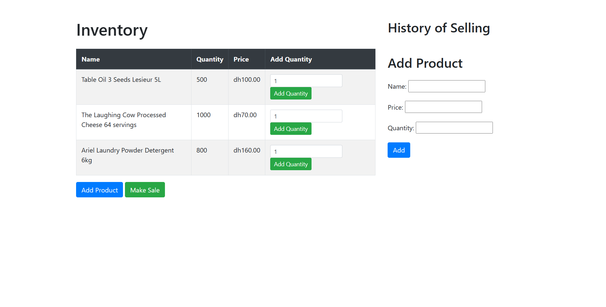
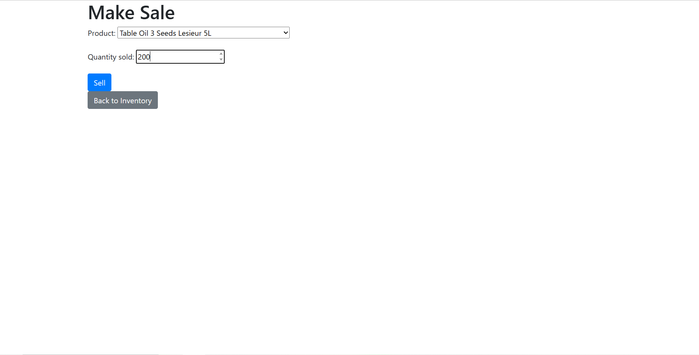
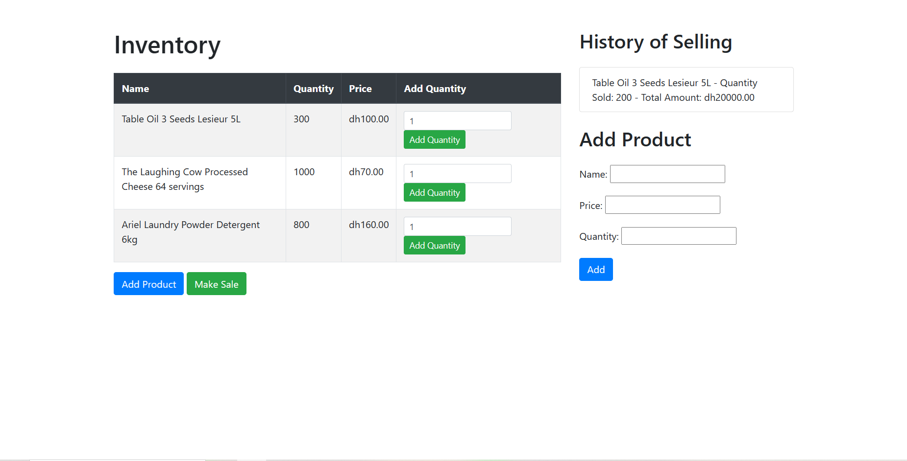

# Grocery Store Management System


This is a simple web-based Grocery Store Management System built using Django. It allows users to manage their inventory, make sales, and view the history of sales.

## Features

- View and manage the inventory of products (add new products, update quantities).
- Make sales by specifying the product and quantity sold.
- View the history of sales with details of each transaction.

## Installation

1. Clone the repository to your local machine:

```
git clone https://github.com/hajarbenjat/Grocery-store-management-system.git
```

2. Change into the project directory:

```
cd grocery-store-management
```

3. Create a virtual environment (optional but recommended):

```
python -m venv env
```

4. Activate the virtual environment:

On Windows:
```
env\Scripts\activate
```

On macOS and Linux:
```
source env/bin/activate
```

5. Install the required packages:

```
pip install -r requirements.txt
```

6. Apply database migrations:

```
python manage.py migrate
```

7. Create a superuser to access the admin interface (optional):

```
python manage.py createsuperuser
```

## Usage

1. Start the development server:

```
python manage.py runserver
```

2. Open your web browser and go to `http://localhost:8000/` to access the Grocery Store Management System.

3. To access the admin interface, go to `http://localhost:8000/admin/` and log in using the superuser credentials created earlier.

## Screenshots





## Contributing

Contributions are welcome! If you find any issues or want to add new features, feel free to open an issue or submit a pull request.

## License

This project is licensed under the MIT License - see the [LICENSE](LICENSE) file for details.

## Contact

If you have any questions or need further assistance, feel free to contact me at [hajarbenjat@email.com].

---